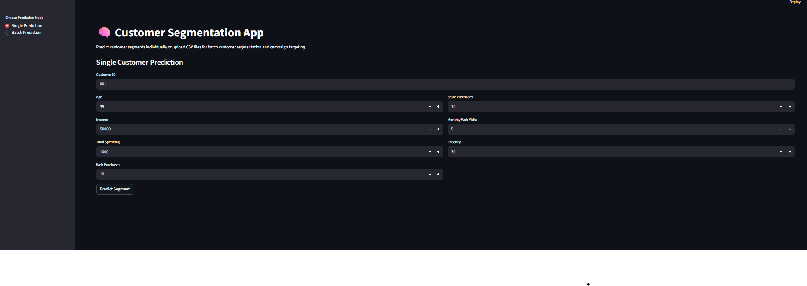
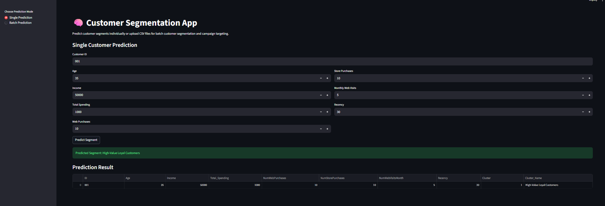
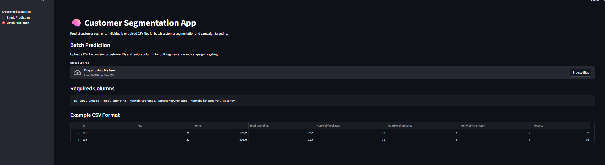
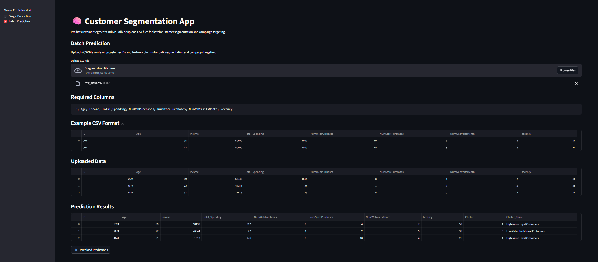

# 🧠 Customer Segmentation Clustering Project

A machine learning-powered customer segmentation system that groups customers based on purchasing behavior, income, engagement, and spending patterns using unsupervised learning (K-Means Clustering).

The project includes:

- data preprocessing
- feature engineering
- clustering pipeline
- automated cluster naming
- Streamlit deployment for single and batch prediction
- downloadable campaign-ready segmentation outputs

---

# 📌 Project Overview

Customer segmentation is a business intelligence technique used to group customers with similar behaviors and characteristics. These segments help organizations:

- personalize marketing campaigns
- improve customer retention
- identify high-value customers
- optimize customer engagement strategies
- increase conversion rates

This project builds an end-to-end customer segmentation pipeline using K-Means clustering and deploys it with an interactive Streamlit application.

---

# 📂 Dataset

## Dataset Source

[Customer Segmentation Dataset (Kaggle)](https://www.kaggle.com/datasets/vishakhdapat/customer-segmentation-clustering)

---

# 📊 Dataset Columns

```python
[
    'ID',
    'Year_Birth',
    'Education',
    'Marital_Status',
    'Income',
    'Kidhome',
    'Teenhome',
    'Dt_Customer',
    'Recency',
    'MntWines',
    'MntFruits',
    'MntMeatProducts',
    'MntFishProducts',
    'MntSweetProducts',
    'MntGoldProds',
    'NumDealsPurchases',
    'NumWebPurchases',
    'NumCatalogPurchases',
    'NumStorePurchases',
    'NumWebVisitsMonth',
    'AcceptedCmp3',
    'AcceptedCmp4',
    'AcceptedCmp5',
    'AcceptedCmp1',
    'AcceptedCmp2',
    'Complain',
    'Z_CostContact',
    'Z_Revenue',
    'Response'
]
```

---

# 🎯 Problem Statement

Businesses often market products to all customers equally, leading to inefficient marketing spend and poor campaign performance.

This project aims to solve that problem by grouping customers into meaningful behavioral segments using clustering techniques. By identifying customers with similar purchasing patterns, engagement levels, and spending behaviors, businesses can:

- target marketing campaigns more effectively
- identify high-value customers
- improve customer retention
- personalize customer experiences
- optimize business decision-making

---

# ⚙️ Project Pipeline

The project follows a complete machine learning workflow:

```text
Data Loading
    ↓
Data Cleaning
    ↓
Feature Engineering
    ↓
Feature Selection
    ↓
Scaling & Imputation
    ↓
K-Means Clustering
    ↓
Cluster Profiling
    ↓
Automated Cluster Naming
    ↓
Model Serialization
    ↓
Streamlit Deployment
```

---

# 🧪 Feature Engineering

The following features were engineered:

| Engineered Feature | Description                         |
| ------------------ | ----------------------------------- |
| Age                | Current year - birth year           |
| Total_Spending     | Sum of all product spending columns |

Note: There are some couple other features engineered in the notebook experiment, do well to experiment with them and as well engineer more reasonable features.

---

# 📌 Final Features Used for Clustering

```python
FEATURES = [
    "Age",
    "Income",
    "Total_Spending",
    "NumWebPurchases",
    "NumStorePurchases",
    "NumWebVisitsMonth",
    "Recency"
]
```

---

# 🤖 Clustering Algorithm

This project uses:

```python
KMeans(n_clusters=3)
```

with:

- `StandardScaler`
- `SimpleImputer`
- `sklearn Pipeline`

---

# 📈 Reason for Choosing K = 3

## Cluster Choice

```text
K = 3
```

## Reason for Choosing K = 3

The selection of the optimal number of clusters was based on a combination of:

- elbow method
- silhouette score
- stability analysis
- business interpretability

From the elbow method, the inertia curve shows a smooth and gradual decline without a sharply defined elbow point. However, there is a noticeable reduction in inertia improvement beyond `K = 3`, suggesting diminishing returns as the number of clusters increases.

From the silhouette analysis, `K = 2` achieved the highest score, indicating stronger separation between clusters. However, the difference between `K = 2` and `K = 3` is relatively small, while higher K values consistently showed declining cluster quality.

The stability analysis also supports this decision. Although `K = 2` showed the highest stability, `K = 3` maintained acceptable consistency while providing richer business insights.

Most importantly, from a business perspective, `K = 2` was considered too coarse for actionable segmentation. `K = 3` enables more practical customer grouping such as:

- high-value customers
- growth customers
- low-value/traditional customers

This provides significantly more value for marketing and customer targeting strategies.

Therefore, `K = 3` was selected because it provides the best balance between:

- cluster compactness
- separation quality
- clustering stability
- business usability

---

# 🧠 Automated Cluster Naming

Clusters are automatically assigned business-friendly labels using cluster profiling metrics:

- value score
- engagement score
- digital engagement score

Example cluster labels:

- High-Value Loyal Customers
- High-Value At-Risk Customers
- Digital Growth Customers
- Low-Value Traditional Customers

---

# 🏗️ Training Pipeline

The training pipeline includes:

- data cleaning
- feature engineering
- K-Means training
- cluster profiling
- automatic cluster labeling
- artifact saving

## Artifacts Saved

```text
models/kmeans_model.joblib
models/cluster_labels.json
```

---

# 🚀 Deployment

The application is deployed using Streamlit and supports:

## ✅ Single Customer Prediction

Predict the segment of a single customer interactively.

## ✅ Batch Prediction

Upload CSV files containing multiple customers and generate segmentation predictions in bulk.

## ✅ Downloadable Predictions

Predictions can be downloaded for campaign targeting and CRM integration.

---

# 🖥️ Application Interface

## Single Prediction Page (Before Prediction)



---

## Single Prediction Page (After Prediction)



---

## Batch Prediction Page (Before Prediction)



---

## Batch Prediction Page (After Prediction)

## 

# 📦 Running the code

## Clone the Repository

```bash
git clone <your-repository-url>
```

## Install Dependencies

```bash
pip install -r requirements.txt
```

---

# ▶️ Run Training Pipeline

```bash
python train.py
```

Note: the training pipeline saves a sample dataset to test the deployed application in `data/test/test_data.csv`

---

# ▶️ Run Streamlit Application

```bash
streamlit run app.py
```

---

# 📁 Project Structure

```text
customer-segmentation/
│
├── assets/
├── data/
├── models/
├── notebook/
├── app.py
├── train.py
├── utils.py
├── requirements.txt
└── README.md
```

---

# 🛠️ Technologies Used

- Python
- Pandas
- NumPy
- Scikit-learn
- Streamlit
- Joblib

---

# 📊 Future Improvements

Potential future upgrades include:

- Project Restructuring
- PCA visualization dashboard
- Customer lifetime value modeling
- Campaign recommendation system
- FastAPI deployment
- Docker containerization
- MLflow experiment tracking
- Cloud deployment
- CI/CD

---

# 📌 Key Learnings

This project demonstrates:

- Unsupervised learning workflows
- Clustering evaluation techniques
- Feature engineering for segmentation
- Business-oriented ML interpretation
- End-to-end ML deployment
- Production-style ML pipelines

---

# 👨‍💻 Author

Developed as an end-to-end customer segmentation machine learning project for marketing analytics and customer intelligence applications.
